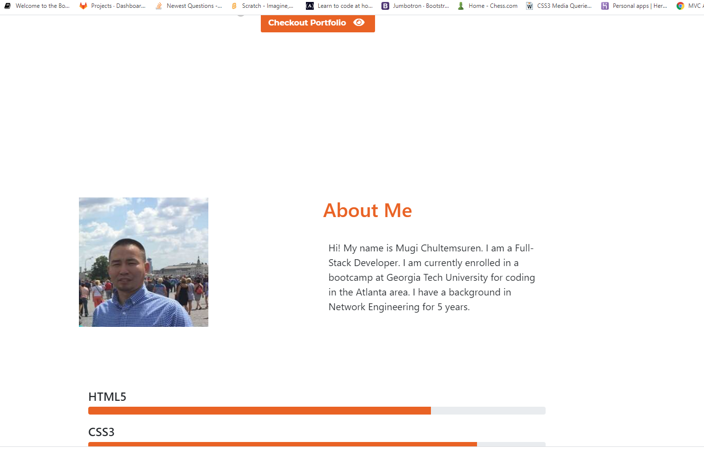
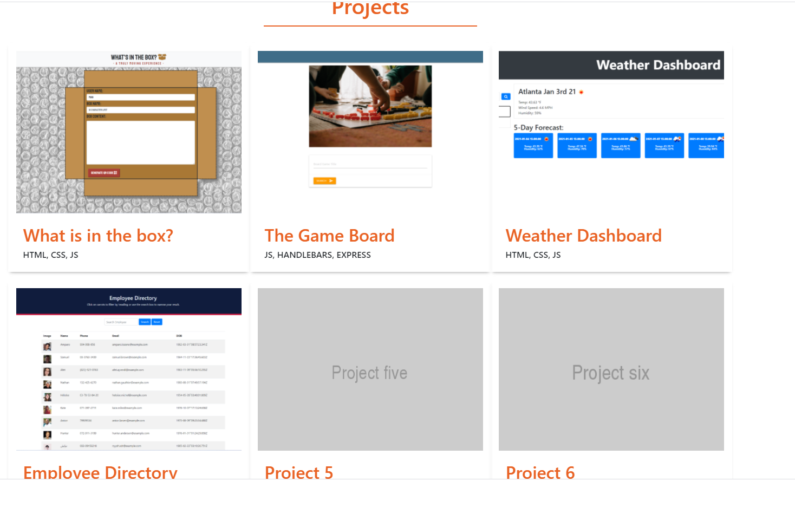

# react-portfolio

## Description

 My updated portfolio displays my GitHub & LinkedIn profile page, as well as my email address and phone number. Additionally,
 I have included two of projects and each project I have included a link to a deployed version and to my GitHub repository.

### Portfolio links

* [deployed portfolio](https://mugich.github.io/react-portfolio/)

* [GitHub repository](https://github.com/mugich/react-portfolio)

### Portfolio's design

